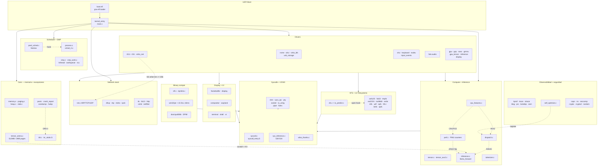
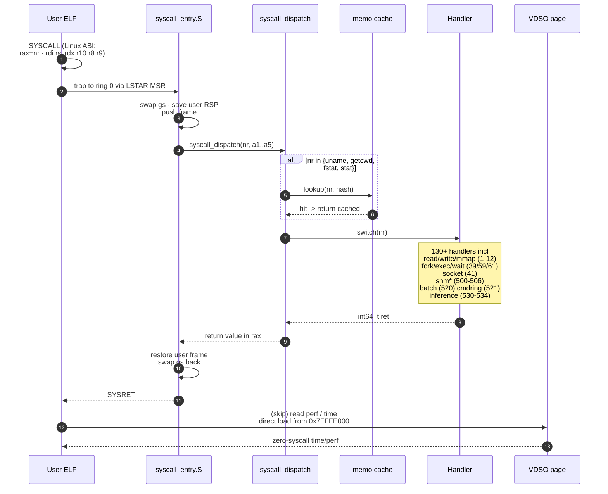
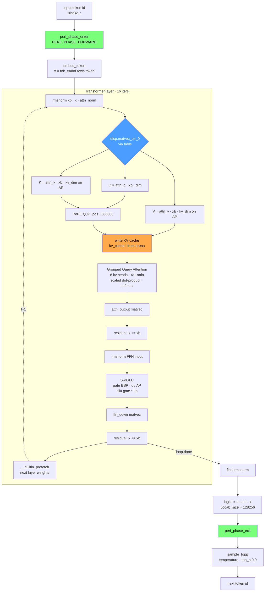
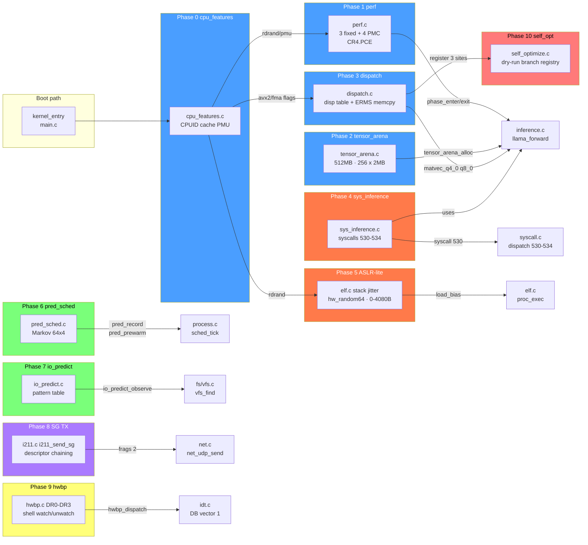

# OsitoK Kernel — Diagramas

5 diagramas Mermaid cubriendo arquitectura, boot, dispatch de syscalls, forward pass de inference y el mapa de integración de las 10 features demenciales. Renderizables directamente en GitHub, VS Code, Obsidian y cualquier viewer Markdown con soporte Mermaid.

---

## 1. Arquitectura — 111 archivos agrupados en 12 subsistemas

Las líneas punteadas son integraciones cross-subsistema de las 10 features recientes (ver §5).

---

## 2. Secuencia de boot — 22 pasos desde UEFI hasta el prompt server

```mermaid
graph TB
    S0[boot.efi carga kernel.elf<br/>pasa boot_info_t]
    S1[zero BSS · save boot_info<br/>copy UEFI memmap]
    S2[serial_init · enable_sse<br/>fb_init]
    S3[cpu_features_detect<br/>CPUID · CR4.OSXSAVE · XCR0]
    S4[perf_init<br/>PMU MSRs · CR4.PCE]
    S5[dispatch_init<br/>cpu_dispatch_t + 3 self_opt sites]
    S6[mem_init · sys_caps_init]
    S7[idt_init<br/>APIC timer · exception vectors]
    S8[paging_init<br/>PML4 · upper-half mirror]
    S9[paging_setup_pat<br/>WC framebuffer · shadow FB]
    S10[heap_init<br/>fpu_percpu_init]
    S11[smp_init<br/>INIT-SIPI-SIPI APs<br/>each AP: perf_init_ap]
    S12[smp_work_init<br/>work-stealing deques]
    S13[syscall_init<br/>vdso_init · vdso_thunks_init]
    S14[proc_init · dl_init<br/>win32_init]
    S15[crypto_selftest parallel<br/>pci_scan on BSP]
    S16[tensor_benchmark on AP<br/>BAR mapping on BSP]
    S17[GPU probe · gpu_init<br/>NVMe init · osfs2/3 mount]
    S18[gguf_load<br/>tok_init from embedded tokenizer]
    S19[tensor_arena_init 512MB<br/>on 256 x 2MB superpages]
    S20[llama_init<br/>scratch+KV from arena]
    S21[network stack<br/>DHCP · NTP · mDNS · IPv6]
    S22[init shell · main loop<br/>UDP 7777 prompt server]

    S0 --> S1 --> S2 --> S3 --> S4 --> S5 --> S6 --> S7 --> S8 --> S9 --> S10
    S10 --> S11 --> S12 --> S13 --> S14 --> S15 --> S16 --> S17 --> S18 --> S19
    S19 --> S20 --> S21 --> S22

    style S3 fill:#4a9eff,color:#fff
    style S4 fill:#4a9eff,color:#fff
    style S5 fill:#4a9eff,color:#fff
    style S19 fill:#4a9eff,color:#fff
    style S20 fill:#4a9eff,color:#fff
```

Los pasos azules son inserciones del commit de las 10 features. S11+S16 corren en paralelo (BSP + AP) gracias a `smp_submit_any`.

---

## 3. Dispatch de syscalls — camino completo ring3 → ring0 → ring3

Caveats: syscalls memoizables (`uname`, `getcwd`, `fstat`, `stat`) cortocircuitan antes del handler cuando el buffer destino y los argumentos coinciden con un hit cacheado.

---

## 4. Forward pass de Llama 3.2 1B — 16 capas + sample

Nodos coloreados: azul = dispatch table (Fase 3), verde = tags de PMU (Fase 1), naranja = memoria de la arena superpage (Fase 2). QKV/FFN large matvecs se paralelizan K/V en APs mientras el BSP procesa Q, y similar gate/up en FFN.

---

## 5. Mapa de integración de las 10 features

Código de colores por capa de stack:

| Color | Capa | Fases |
|-------|------|-------|
| 🔵 azul | Compute / boot-time | 0 · 1 · 2 · 3 |
| 🟠 naranja | Process + syscall | 4 · 5 |
| 🟢 verde | Scheduler / FS | 6 · 7 |
| 🟣 violeta | Networking | 8 |
| 🟡 amarillo | Debug | 9 |
| 🔴 rojo | Self-modify | 10 |

---

## Ver también

- [`docs/kernel-demencial.md`](kernel-demencial.md) — descripción detallada de las 10 features
- [`docs/kernel-architecture.md`](kernel-architecture.md) — arquitectura previa (pre-features)
- [`docs/kernel-separation.md`](kernel-separation.md) — split boot.efi + kernel.elf
- [`docs/x86-features-detail.md`](x86-features-detail.md) — catálogo de X9-X42 + X-OS* + X-NET*
